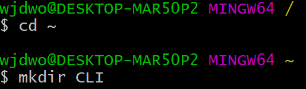
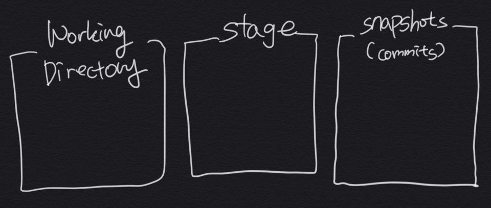

# Git 기초

## 1. 인터페이스 (Interface)

​	서로 다른 두 대상이 맞닿아 있는 접점

### CLI (Command Line Interface)

​	

### GUI (Grapic User Interface)

## 2. 구성

​	Git은 하나의 사진으로 보면 이해가 쉽다.  Working Directory, Stage, Snapshots(commits)로 구성되어 있다.

### 1) Working Directory

- 작업이 이루어지는 공간.
- Stage에 add하지 않을 경우 commit 할 수 없다.

### 2) Stage

- stage에 올라오고 commit 하면 commit에 안전하게 저장.

### 3) Snapshots(Commits)

- 안전하게 저장된 공간.

## 3. 명령어

| 명령어                 | 기능                                | 예시                |
| ---------------------- | ----------------------------------- | ------------------- |
| cd                     | 폴더 이동 (. 현재위치 .. 상위폴더)  | `$ cd 위치`         |
| mkdir (make directory) | 폴더 생성                           | `$ mkdir CLI`       |
| touch                  | 파일 생성                           | `$ touch CLI.txt`   |
| mv (move)              | 파일 이동                           | `$ mv CLI.txt CLI/` |
| ls (list)              | 현재 위치 파일 목록 불러오기        | `$ ls`              |
| rm (remove)            | 파일 삭제                           | `$ rm CLI.txt`      |
| rm -r                  | 폴더 삭제                           | `$ rm -r CLI`       |
| init (initialize)      | 새로운 git 저장소로 초기화 (master) | `$ git init`        |
| vim                    | 에디터                              | `$ vim text.txt`    |

